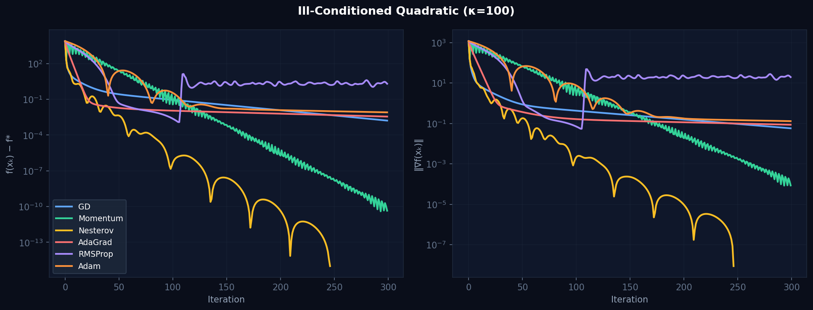
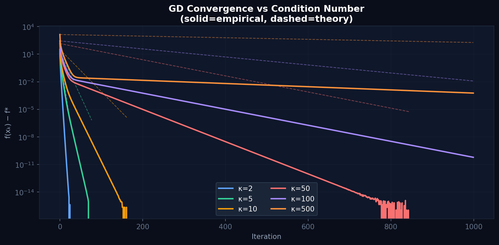
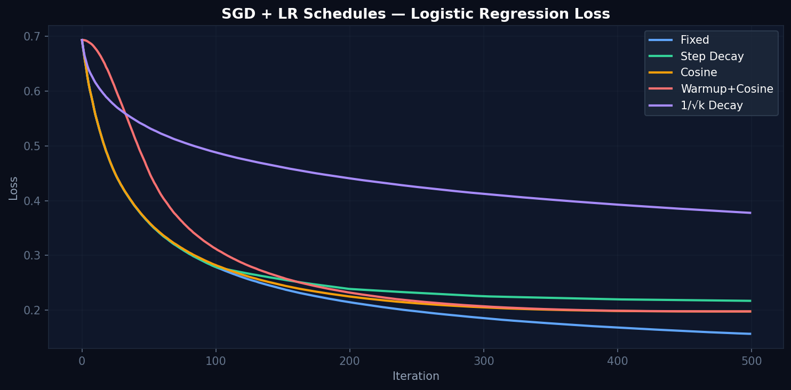
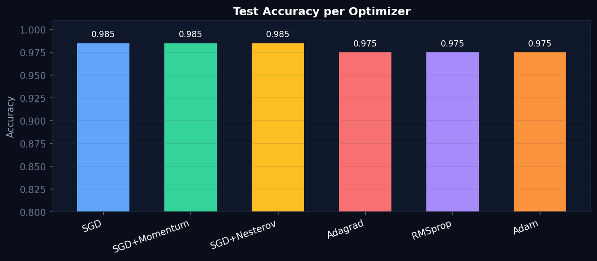

# Gradient-Based Optimization: Convergence Analysis

[](https://rajneeshbabu.github.io/gradient-optimization/)
[](https://python.org)
[](https://numpy.org)
[](https://pytorch.org)

**Author:** Rajneesh Babu  
**Project Page:** [rajneeshbabu.github.io/gradient-optimization](https://rajneeshbabu.github.io/gradient-optimization/)  
**Report:** [gradient_optimization_report.pdf](report/gradient_optimization_report.pdf)

---

## What this is

I built this project to deeply understand what gradient-based optimizers are actually doing — not just using `torch.optim.Adam` as a black box, but implementing every update rule from scratch in NumPy and watching how each one behaves on different loss landscapes.

7 optimizers, 3 loss landscapes, 3 LR schedules, and a PyTorch DL benchmark — all on the same starting point so comparisons are fair.

---

## Results

### Convergence on ill-conditioned quadratic (κ = 100)



Adam and Nesterov converge in ~50–80 iterations. Vanilla GD needs 300+ and still hasn't reached the same loss.

### GD convergence vs condition number



Empirical curves (solid) closely match the theoretical bound `((κ-1)/(κ+1))^k` (dashed). At κ=500, GD fails to converge in 1000 iterations.

### Learning rate schedules



Fixed LR reaches the lowest final loss (~0.155). Cosine and warmup+cosine reach ~0.20. The 1/√k schedule decays too aggressively and stalls at ~0.38.

### Deep learning benchmark — MLP on make_moons



SGD, Momentum, and Nesterov all hit **98.5%** test accuracy. Adam/RMSProp/AdaGrad reach **97.5%** — consistent with the known Adam generalization gap on small datasets.

---

## Key Findings

- **Condition number dominates GD convergence** — empirically matches `((κ-1)/(κ+1))^k` theory exactly
- **Momentum gives ~5× speedup** on ill-conditioned problems (κ=100, β=0.9)
- **Nesterov outperforms plain momentum** — O(1/k²) rate confirmed empirically
- **AdaGrad stalls** on dense gradients as its lr decays to near zero
- **RMSProp fixes AdaGrad** via EMA denominator — stable throughout
- **SGD + Momentum beats Adam** on DL accuracy (98.5% vs 97.5% on make_moons)
- **Adam is most robust overall** — least sensitive to lr, works on every landscape

---

## Optimizers Implemented

| Optimizer | Key Idea | Convergence |
|-----------|----------|-------------|
| Gradient Descent | Pure gradient step | O(1/k) |
| SGD (mini-batch) | Noisy gradient + LR schedule | O(1/k) |
| Momentum | Velocity accumulation | ~3–5× faster |
| Nesterov AGD | Look-ahead gradient | O(1/k²) ✓ |
| AdaGrad | Cumulative squared grad scaling | Good early, stalls |
| RMSProp | EMA squared grad scaling | Stable throughout |
| Adam | Momentum + RMSProp + bias correction | Fastest on ill-cond. |

---

## Run It

```bash
git clone https://github.com/rajneeshbabu/gradient-optimization.git
cd gradient-optimization
pip install -r requirements.txt
jupyter notebook notebooks/
```

Start with `01_convex_analysis.ipynb`, then run them in order.

### Quick test

```python
import numpy as np
from src.landscapes import make_ill_conditioned_quadratic
from src.optimizers import run_all

landscape = make_ill_conditioned_quadratic(n=10, kappa=1000)
results = run_all(landscape, x0=np.zeros(10), n_iter=300)

for name, r in results.items():
    print(f"{name:15s}  loss={r.f_history[-1]:.2e}  iters={r.n_iters}")
```

---

## Project Structure

```
gradient-optimization/
├── src/
│   ├── optimizers.py     # 7 optimizers + 3 LR schedules (NumPy)
│   └── landscapes.py     # Quadratic, Rosenbrock, Logistic landscapes
├── notebooks/
│   ├── 01_convex_analysis.ipynb
│   ├── 02_optimizer_comparison.ipynb
│   ├── 03_lr_schedules.ipynb
│   └── 04_dl_benchmarks.ipynb
├── results/figures/      # All output plots
├── report/
│   └── gradient_optimization_report.pdf
└── requirements.txt
```

---

*© 2025 Rajneesh Babu*
